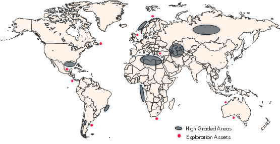
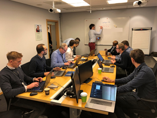
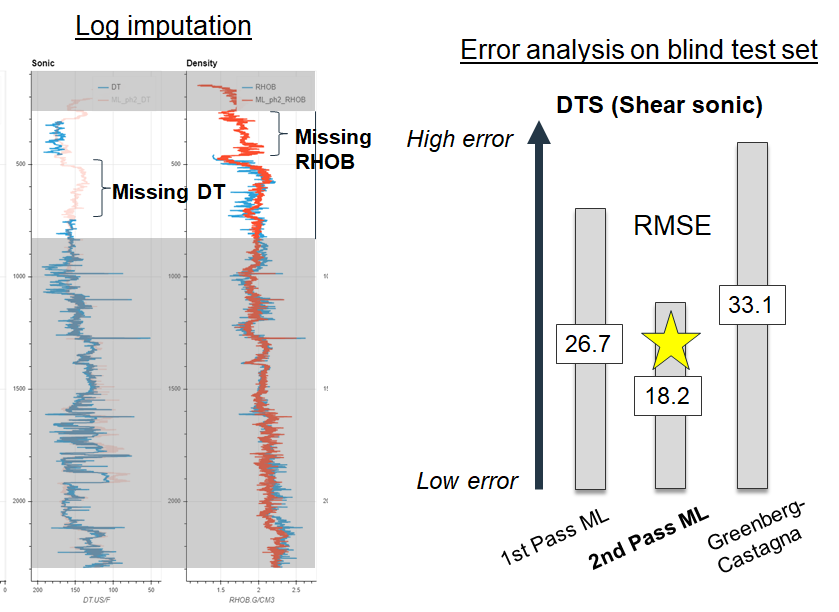

# EPI SUB EXD Global Analytics

## Exploration interest in SparkBeyond

The primary objective of Exploration is to discover commercial volumes of oil and gas in accordance with Equinor's values and priorities. As is the case with subsurface work in general, a considerable challenge to achieving this ambition is our ability to make the most out of the vast amount of data available. Exploration's interest in using the SparkBeyond platform is to accelerate our efforts to leverage our subsurface data for insights that allow us to achieve our ambitions.

## Exploration involvement 

Exploration's involvement with DCoE Ideation Machine and SparkBeyond has been from the start during both the POC (summer 2019) and Pilot (2019-2020) phases. Exploration's use of the SparkBeyond platform is facilitated within the Global Analytics Project (following the NUKE Analytics Project), a team comprised of G&G working specifically on using data science approaches and scripting solutions directly with the business areas.

The Project has a number of on-going initiatives that use the SparkBeyond platform and two use-cases are described in the next sections.

<!--  -->

## Petrophysical log enrichment use-case

Composite petrophysical logs collected within wellbores are heavily relied on to characterize the subsurface including to understand rock properties and as an indicator for the presence of hydrocarbons. Our project aims to enhance our use of these logs in two ways: 1) the prediction of synthetic logs to 'impute' or replace sections of logs that are missing based on the presence of other logs and 2) to predict useful properties like porosity, volume of shale, and hydrocarbon presence and phase. 

We use SparkBeyond for these supervised machine learning problems because of the advanced feature engineering capabilities, including depth or time series functionality, and ease of joining complementary datasets ('contextualization') to make our models more predictive. Our results can outperform existing empirical approaches (see Figure to the right). 

## Stratigraphy use-case

Meaningful correlation of subsurface data between wells requires an understanding of the stratigraphic age of formations. Typically this is delivered as a 'pick' or specific depth within a wellbore representing an absolute age, for example. Our project aims to go a step further and deliver a continuous age curve prediction along the entire wellbore based on training SparkBeyond models using the recorded raw fossil abundances from cuttings and cores (see Figure to the left). Applying the depth or time series functionality in SparkBeyond has strengthened our predictive models.

