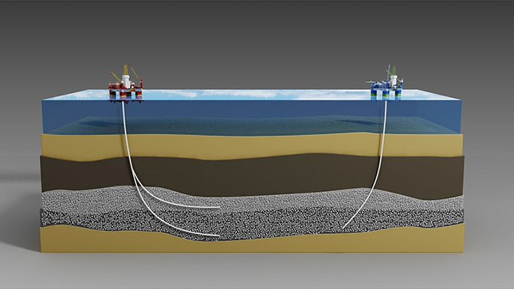
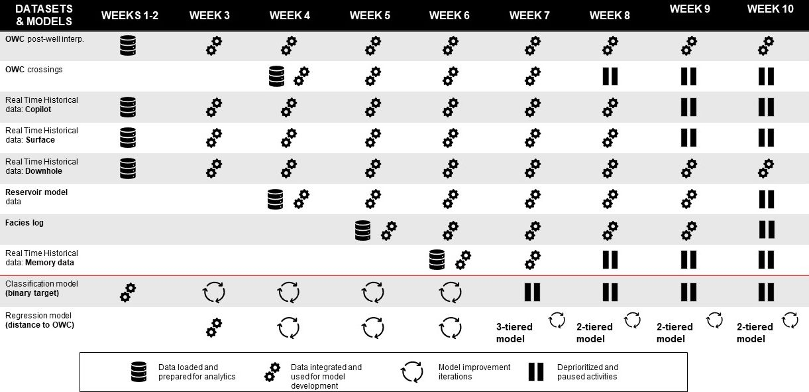
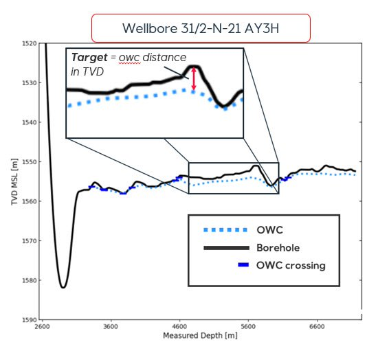
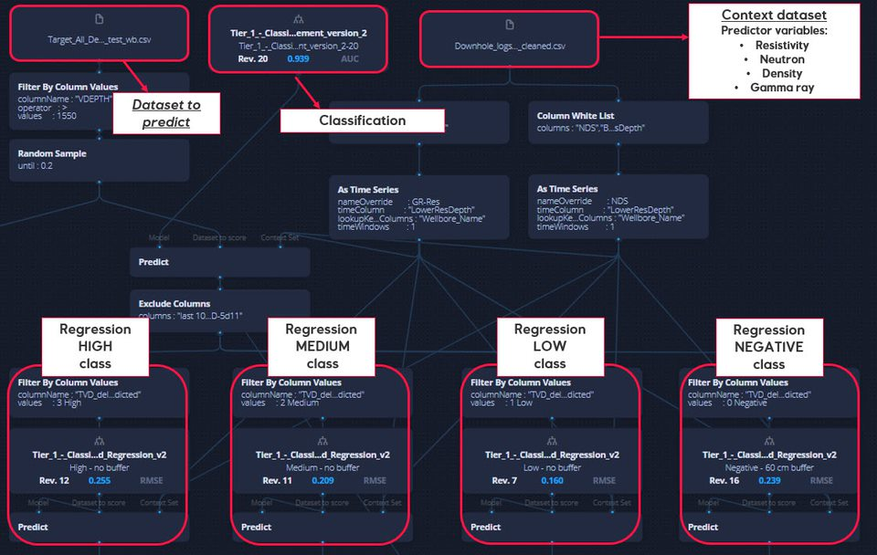
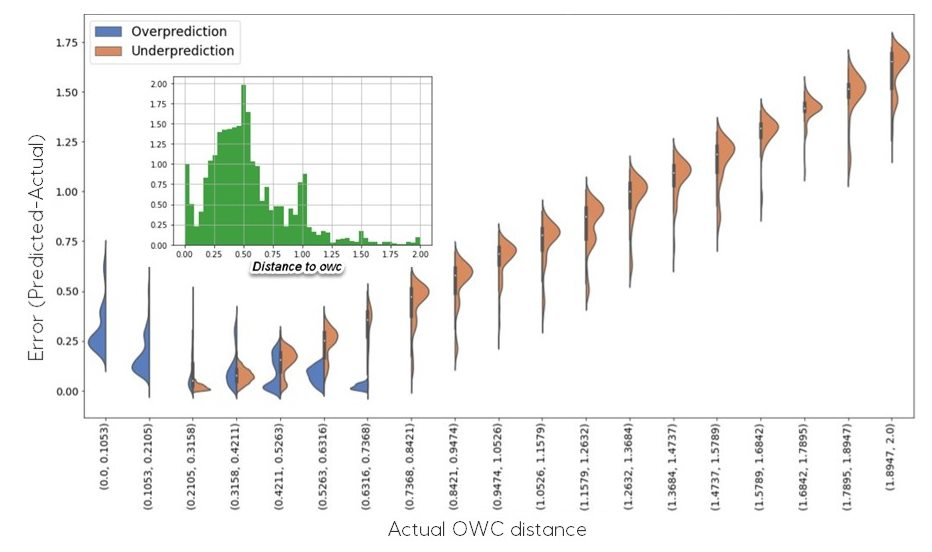
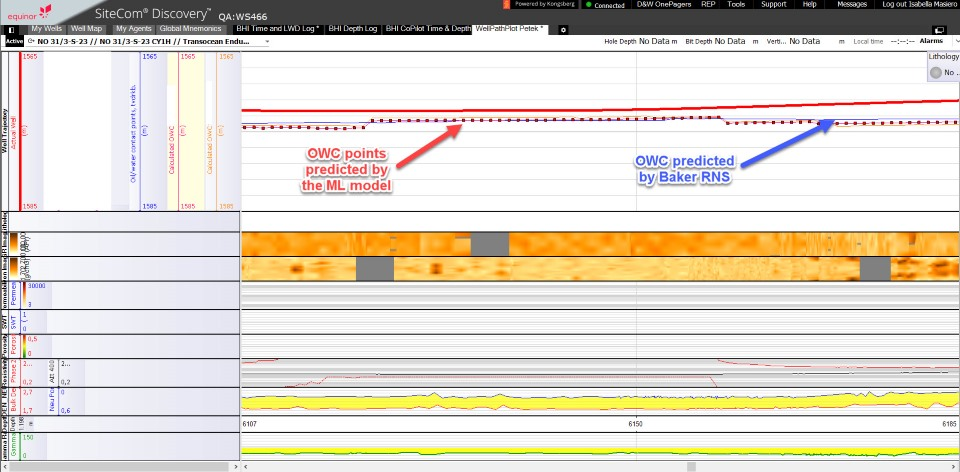
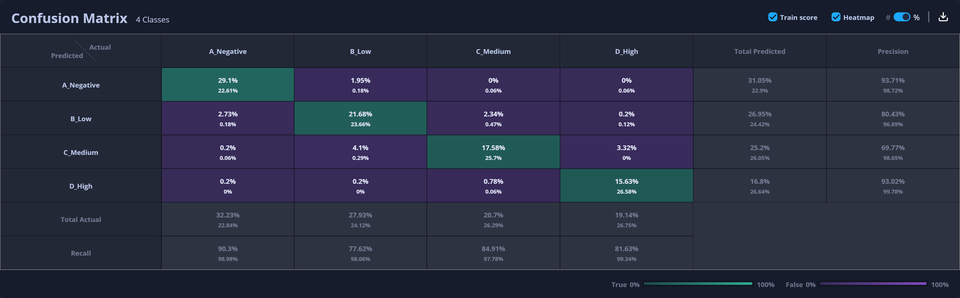
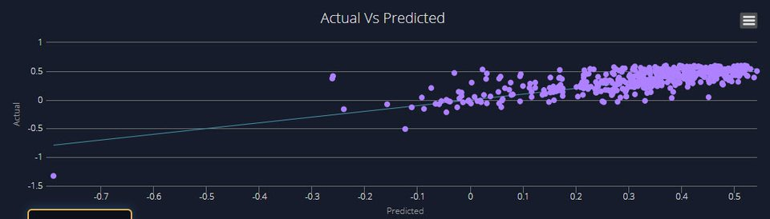

# GOC - data driven well placement

Mature fields are characterized by large amount of logging data acquired during drilling of production wells (Real Time Drilling Data). These logging measurements are used by drilling operators to make geosteering decisions, ensuring optimal well placement and maximizing economic production.

In the Troll field hundreds of wells have be drilled in the past  years, generating a vast repository of historical drilling data. In this scenario, analytic techniques represent an effective approach to leverage these large datasets, leading to better data-driven decision making. 

Two use cases are currently running in collaboration with the Geo-operation Center (GOC). These projects use the Ideation Machine platform to develop analytic models that aim to optimize well placement in the Troll field.

## Fluid contact prediction use case

### Overview

​​​​​​​In the Troll field the main geosteering criteria for maximizing recovery is to place the well approximately one meter above the oil-water contact (OWC). Optimal well placement requires the operator to interpret the log data in real time during drilling to determine the distance between the wellbore and the fluid contact.  

The main objective of the fluid contact prediction use case is to develop a machine learning model able to predict in real time the distance to the oil-water contact from drilling data. The developed model aims to provide automated petrophysical interpretation support to the geo-operators.

### Project execution

A joined Equinor and SparkBeyond team has worked together in a structured Agile sprints during a 10 weeks proof of concept (POC). 

During the POC, a large and heterogeneous amount of data has been prepared for analytic. Starting from a simple naïve model, continuous improvement iterations have been implemented. The main result of the POC has been a working minimum viable product (MVP) that validated the project technical feasibility .  

Currently, the project is focusing on the model refinement and result implementation in existing software. A prototype is being developed to serve the end user with a preliminary product to test and evaluate.

### Model elements

Model target -> distance in TVD between the wellbore and the OWC

Training dataset -> the training dataset has been developed using the OWC manual interpretation. This dataset includes thousands of post-well manual interpretation points of the fluid contact.

Predictor variables -> during the POC, a large amount of data has been quantitatively evaluate to identify the variables with the highest predictive power on the target.

These variables include: 
- Resistivity 
- Gamma ray
- Neutron
- Density

### The model pipeline

The predictive model includes a combined classification and regression approach, providing increasing degrees of prediction accuracy.

1st step - a classification algorithm classifies the fluid contact into 4 classes of distance (negative, low, medium and high)

2nd step - a regression algorithm predicts the actual numerical distance from the OWC in TVD (True Vertical Depth). For each distance class a dedicated regression model has been trained. 

### Error analysis and model improvement

Improvement steps include:
  - A detailed error analysis has been performed to identify the drivers of the largest prediction errors. The target imbalance has been identified as the main driver. This has been mitigated through the implementation of a combined classification and regression approach. 
  - Overfitting management at a model and features level. It was not possible to fully resolve the model overfitting. This is likely due existing heterogeneities between wells. 

### Model results 

Preliminary results are promising. However, model refinement work is still ongoing. This work includes:
  - Model results upload and display into Sitecom to deliver the predicted OWC log curve to the end user for feedback (this work is supported by the REAL project team)
  
  - Calculation of the prediction uncertainty 
### Classification performance

### Regression performance

