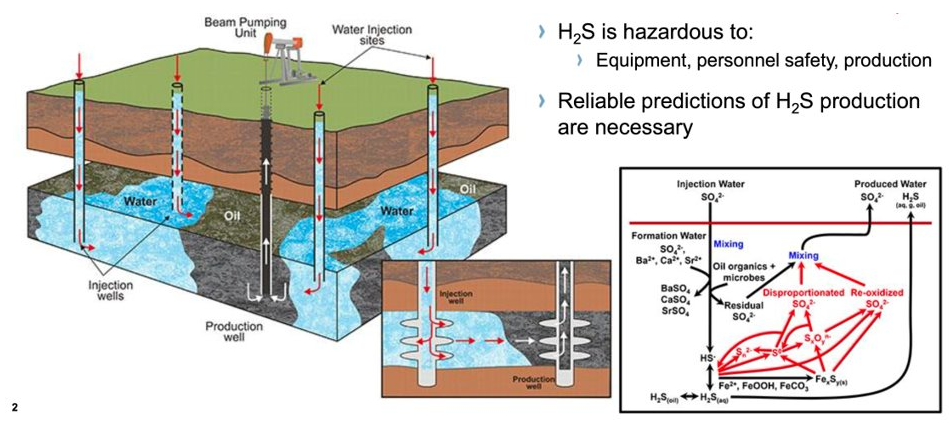

# H2S reservoir sounding
The H2S use case aims to predict H2S production in wells on the Gullfaks field on the NCS. Increasing H2S levels in some of our fields on the NCS is an increasing problem both for safety and revenue. The drivers and causes of H2S production it is not well understood. The Ideation Machine team has teamed up with the Data-Driven Prediction and Decision team and the Gullfaks asset to utilize Machine Learning to predict H2S production in the Gullfaks field. 

Hydrogen Sulfide (H2S) is hazardous (and even deadly) to our personnel and our equipment (HSE), and  is detrimental to oil quality (value). Estimating H2S production is important for reservoir and production management, allowing engineers to both manage operational optimizations and planning in the field.  

