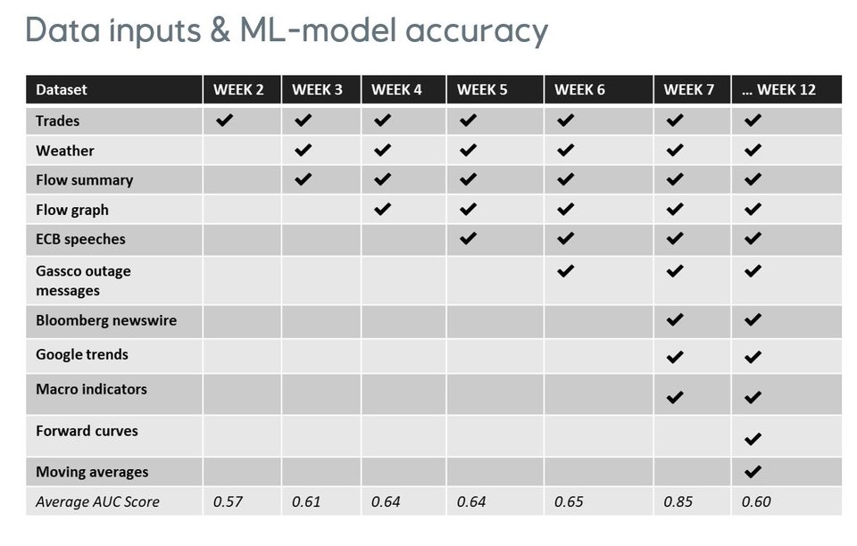

# MMP - natural gas trading prediction

Ideation machine project  leveraged SparkBeyond technology within MMP natural gas trading domain through  a successful completion of PoC in Q2 2020.  The aim was to increase MMP’s bottom line value by monetizing on trading strategies built around gained market and price insights through data driven platform like SparkBeyond.

