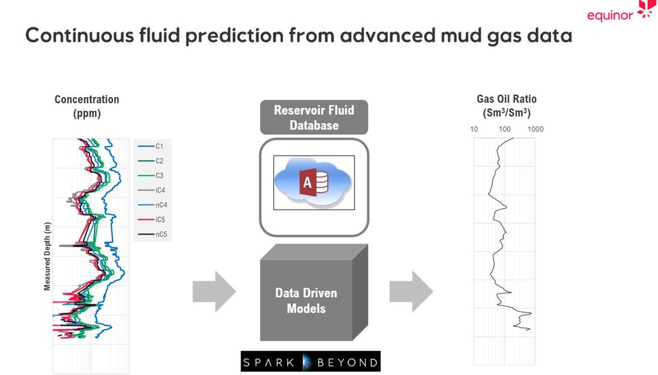

# Mud gas - real time fluid idntification

R&T advanced mud gas team, led by industry leading researcher Dr Tao Yang, has been a great champion of implementing SparkBeyond technology in Equinor.

Since 2020, Mud gas team has been key contributor of value realization for ideation machine project. Data Analytics generated from SparkBeyond platform has been an enabler for Advanced mud gas team.  For further details, please consult the following slide deck:  [link](https://statoilsrm.sharepoint.com/sites/Ideation_Machine/Use%20case%20examples/Forms/AllItems.aspx?id=%2Fsites%2FIdeation%5FMachine%2FUse%20case%20examples%2FReal%2Dtime%20Fluid%20Identification%20%28RFID%29%20%2D%20Insight%2Epdf&parent=%2Fsites%2FIdeation%5FMachine%2FUse%20case%20examples)

